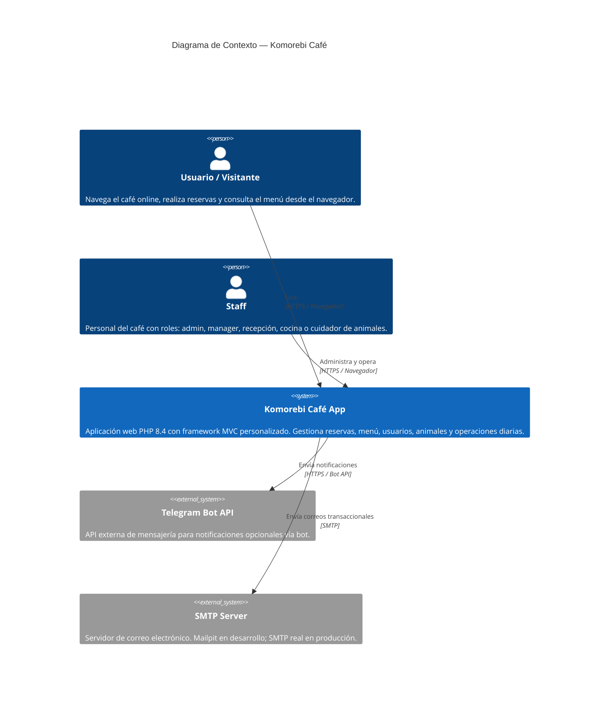
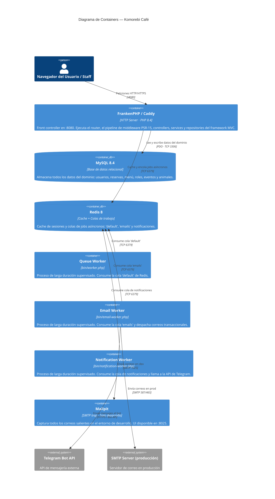

# Diagrama de Arquitectura — C4 Context y Containers

Vista de alto nivel de la arquitectura de Komorebi Café usando la notación C4. El primer diagrama muestra el contexto del sistema y sus actores externos; el segundo descompone el sistema en sus containers de infraestructura y procesos.

---

## Diagrama de Contexto (C4 Level 1)

Muestra quién usa el sistema y con qué sistemas externos se integra.

---

## Diagrama de Containers (C4 Level 2)

Desglosa el sistema en sus containers: procesos ejecutables, bases de datos y servicios auxiliares.

---

## Leyenda y Notas

| Container          | Puerto | Entorno         |
|--------------------|--------|-----------------|
| FrankenPHP / Caddy | 8080   | Todos           |
| MySQL              | 3306   | Todos           |
| Redis              | 6379   | Todos           |
| Mailpit SMTP       | 1025   | Solo desarrollo |
| Mailpit UI         | 8025   | Solo desarrollo |

- Los tres **workers** son procesos PHP de larga duración supervisados por **Supervisor** (`docker/supervisor.conf`).
- La configuración se inyecta exclusivamente via variables de entorno (**12-Factor III**).
- Los secretos se resuelven con `SecretLoader::require('key')`: primero env var, luego `/run/secrets/<key>`.
- Todo el **estado de sesión** se almacena en Redis para soportar escalado horizontal sin estado compartido en disco.
