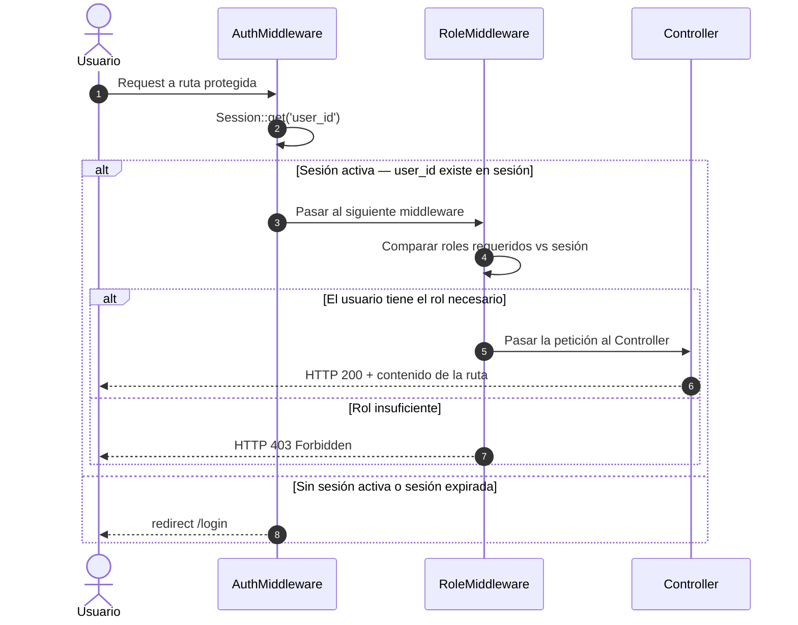

# Flujo de Autenticación y RBAC

Diagrama de secuencia que muestra el proceso completo de login —validación CSRF, búsqueda de usuario, verificación de contraseña Argon2id y carga de roles— y la verificación posterior de autenticación y permisos RBAC en cada petición a una ruta protegida.

---

## Flujo de Login

```mermaid
sequenceDiagram
    autonumber

    actor Usuario
    participant AC as AuthController
    participant CSRF as CsrfMiddleware
    participant AS as AuthService
    participant UR as UserRepository
    participant S as Session

    Usuario->>AC: POST /login (email, password)
    AC->>CSRF: Verificar token CSRF
    CSRF-->>AC: Token válido

    AC->>+AS: login(email, password)
    AS->>+UR: findByEmail(email)

    alt Usuario encontrado y contraseña correcta
        UR-->>AS: User (con hash Argon2id)
        AS->>AS: password_verify(input, hash)
        AS->>UR: getRoles(userId)
        UR-->>-AS: roles[] + permissions[]
        AS-->>-AC: Result::ok(['user' => ..., 'roles' => ...])
        AC->>S: set('user_id', $id)
        AC->>S: set('roles', $roles)
        AC-->>Usuario: redirect /dashboard
    else Usuario no encontrado o contraseña incorrecta
        UR-->>-AS: null
        AS-->>-AC: Result::fail('Credenciales incorrectas', 'auth_failed')
        AC-->>Usuario: Flash::error() + redirect /login
    end
```

---

## Verificación RBAC en Peticiones Protegidas



---

## Notas de Seguridad

| Aspecto | Implementación |
|---|---|
| Hash de contraseña | `password_hash()` con `PASSWORD_ARGON2ID` |
| Protección CSRF | Token por sesión validado en `CsrfMiddleware` (POST · PUT · PATCH · DELETE) |
| Gestión de sesión | PHP sessions con Redis como backend de almacenamiento |
| RBAC | Roles: `admin`, `manager`, `supervisor`, `reception`, `kitchen`, `keeper`, `user` |
| Rate limiting | `RateLimitMiddleware` limita intentos de login por IP y usuario |
| Constantes de rol | `ROLE_ADMIN`, `ROLE_MANAGER`, etc. definidas en `App\Core\Middleware` |

- **`password_verify`** ejecuta una comparación en tiempo constante para prevenir ataques de temporización (_timing attacks_).
- Si el token CSRF falla, `CsrfMiddleware` cortocircuita el pipeline inmediatamente y devuelve HTTP 419 sin llegar al controller.
- Las contraseñas **nunca** se loggean. El `Logger` registra solo el email y el resultado boolean del intento de autenticación.
- Los roles se almacenan en sesión para evitar una query a base de datos en cada petición; se invalidan forzando `Session::regenerate()` tras cambios de rol.
