# Ciclo de Vida de una Petición HTTP

Traza el camino completo de una petición HTTP desde el navegador hasta la respuesta, pasando por el front controller, el router, el pipeline de middleware PSR-15 (15 middlewares), el controller, el service y el repository. Se muestran dos stacks paralelos: **web** y **API `/api/v1`**.

---

## Stack Web — Flujo completo (15 middlewares)

```mermaid
flowchart LR
    Browser(["Browser\nHTTP Request"])
    FrontCtrl["public/index.php\nFront Controller\nBootstrap DI Container"]
    Router["Router::dispatch()\nMatch ruta → Controller@method"]

    subgraph pipeline_web ["Pipeline Web — PSR-15 secuencial"]
        direction TB
        MW1["1. ErrorHandlerMiddleware\nCaptura Throwable · respuesta 500"]
        MW2["2. SecurityHeadersMiddleware\nCSP · HSTS · X-Frame-Options"]
        MW3["3. RequestLogMiddleware\nLoga método · URI · tiempo"]
        MW4["4. SessionMiddleware\nInicializa sesión PHP · Redis backend"]
        MW5["5. CsrfMiddleware\n(POST · PUT · PATCH · DELETE)"]
        MW6["6. RateLimitMiddleware\nLímite por IP/usuario · Redis"]
        MW7["7. PayloadSizeMiddleware\nRechaza body > límite configurado"]
        MW8["8. CorsMiddleware\nCabeceras CORS (solo /api/v1)"]
        MW9["9. AuthMiddleware\nVerifica session user_id"]
        MW10["10. ApiAuthMiddleware\n(solo rutas /api/v1)"]
        MW11["11. RoleMiddleware\nRBAC: rol de sesión"]
        MW12["12. ApiRoleMiddleware\n(solo rutas /api/v1)"]
        MW13["13. AuthorizationMiddleware\nPermisos finos por recurso"]
        MW14["14. CafeScopeMiddleware\nRestringe datos al café del staff"]
        MW15["15. IdempotencyMiddleware\n⚠ Solo POST /api/v1/reservations\nUUID v4 header → Redis 24h"]
        MW1 --> MW2 --> MW3 --> MW4 --> MW5 --> MW6 --> MW7 --> MW8
        MW8 --> MW9 --> MW10 --> MW11 --> MW12 --> MW13 --> MW14 --> MW15
    end

    Controller["Controller\nValidar input\nLlamar al Service"]
    Service["Service\nLógica de negocio\nreturn Result"]
    Decision{"Result::ok?"}
    Repository["Repository\nConsulta PDO"]
    MySQL[("MySQL")]
    ResponseOk["ResponseFactory\njson() / redirect() /\nView::render()"]
    FlashError["Flash::error()\nRedirect de vuelta"]
    BrowserOk(["Browser\nRespuesta exitosa"])
    BrowserError(["Browser\nRedirect / error"])

    Browser -->|"GET / POST / ..."| FrontCtrl
    FrontCtrl --> Router
    Router --> pipeline_web
    MW15 --> Controller
    Controller --> Service
    Service --> Decision
    Decision -->|"ok = true"| Repository
    Repository --> MySQL
    MySQL --> ResponseOk
    ResponseOk --> BrowserOk
    Decision -->|"ok = false"| FlashError
    FlashError --> BrowserError
```

---

## Stack API `/api/v1` vs Web — Diferencias de pipeline

```mermaid
flowchart TB
    subgraph web ["Stack Web (rutas /*)"]
        direction LR
        W1["ErrorHandler"] --> W2["SecurityHeaders"] --> W3["RequestLog"] --> W4["Session"]
        W4 --> W5["CSRF"] --> W6["RateLimit"] --> W7["PayloadSize"]
        W7 --> W9["Auth"] --> W11["Role"] --> W13["Authorization"] --> W14["CafeScope"]
    end

    subgraph api ["Stack API (rutas /api/v1/*)"]
        direction LR
        A1["ErrorHandler"] --> A2["SecurityHeaders"] --> A3["RequestLog"] --> A4["Session¹"]
        A4 --> A6["RateLimit"] --> A7["PayloadSize"] --> A8["CORS"]
        A8 --> A10["ApiAuth\n(Bearer token)"] --> A12["ApiRole"] --> A13["Authorization"]
        A13 --> A15["Idempotency²"]
    end

    note1["¹ Session no activa autenticación en API\n② Solo en POST /api/v1/reservations"]
```

---

## Notas sobre el Flujo

- **Front Controller**: `public/index.php` es el único punto de entrada. Carga el autoloader de Composer y el contenedor de dependencias (`bootstrap/container.php`).
- **Router**: Compara la ruta con las definiciones en `app/routes.php`. Si no hay coincidencia devuelve 404; si el método HTTP no coincide devuelve 405.
- **Middleware Pipeline**: Se ejecuta de forma secuencial (PSR-15). Cualquier middleware puede cortocircuitar el pipeline devolviendo una respuesta temprana —por ejemplo, un redirect a `/login` si no hay sesión activa.
- **ErrorHandlerMiddleware**: Primero del pipeline para que envuelva todos los demás. Captura cualquier `Throwable` y devuelve HTTP 500 con log de error.
- **IdempotencyMiddleware**: Exclusivo de `POST /api/v1/reservations`. Verifica el header `Idempotency-Key` (UUID v4). Si hay hit en Redis devuelve la respuesta cacheada sin ejecutar el handler; si hay miss, procesa y guarda el resultado 24 horas.
- **Result pattern**: Todos los services devuelven `Result::ok($data)` o `Result::fail('mensaje', 'error_code')`. Nunca lanzan excepciones para fallos esperados de dominio.
- **ResponseFactory**: Inyectado en todos los controllers vía constructor. Métodos principales: `redirect()`, `json()`, `html()`.
- **View::render()**: Hace echo directo y devuelve `null`; el controller retorna `null` implícitamente. Para datos dinámicos usa `Raw::json()` o `Raw::html()` para saltarse el auto-escape.
