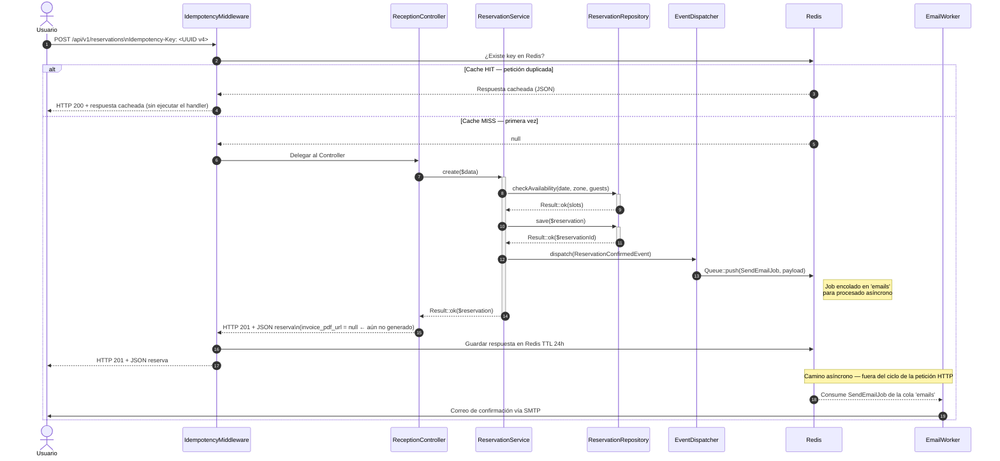

# Flujo de Creación de Reserva

Diagrama de secuencia que muestra la interacción completa entre los componentes del sistema durante la creación de una nueva reserva: verificación de disponibilidad, guardado de la reserva, disparo del evento PSR-14 y envío asíncrono del correo de confirmación.

---

## Flujo Exitoso (con IdempotencyMiddleware)



> **Nota:** `invoice_pdf_url` es `NULL` en la respuesta de confirmación. Se asigna de forma asíncrona
> tras generar el PDF de factura (job separado en la cola `'default'`). El cliente puede consultar
> el endpoint `GET /api/v1/reservations/{id}` para obtener la URL cuando esté disponible.

---

## Flujos de Error

```mermaid
sequenceDiagram
    autonumber

    actor Usuario
    participant RC as ReceptionController
    participant RS as ReservationService
    participant RR as ReservationRepository

    Usuario->>RC: POST /reservas (date, zone, guests)
    RC->>+RS: create($data)
    RS->>+RR: checkAvailability(date, zone, guests)

    alt Sin disponibilidad en el turno solicitado
        RR-->>RS: Result::fail('Sin plazas disponibles', 'no_availability')
        RS-->>-RC: Result::fail('Sin plazas disponibles')
        RC->>Usuario: Flash::warning() + redirect /reservas/nueva
    else Validación fallida (fecha inválida, datos incorrectos)
        RR-->>RS: Result::fail('Fecha inválida', 'validation_error')
        RS-->>-RC: Result::fail('Fecha inválida')
        RC->>Usuario: Flash::error() + redirect /reservas/nueva
    end
```

---

## Notas

- **IdempotencyMiddleware**: Verifica el header `Idempotency-Key` (UUID v4 requerido en `POST /api/v1/reservations`). En caso de hit en Redis devuelve la respuesta anterior sin llegar al Controller, garantizando que una red lenta no genere reservas duplicadas.
- **checkAvailability**: Consulta las tablas `time_slots` y `reservations` para verificar que quedan plazas en el turno y zona solicitados.
- **ReservationConfirmedEvent**: Evento PSR-14 registrado en `app/Providers/EventServiceProvider.php`. El listener registrado encola `SendEmailJob` en la cola `'emails'` de Redis.
- **EmailWorker** (`bin/email-worker.php`): Proceso de larga duración gestionado por Supervisor. Consume jobs de la cola `'emails'` y usa PHPMailer para despachar.
- **`invoice_pdf_url`**: El campo es `NULL` en el momento de la confirmación. La URL se asigna de forma asíncrona una vez generado el PDF de factura (job en la cola `'default'`).
- La petición HTTP responde **inmediatamente** tras guardar la reserva. El envío del correo es completamente asíncrono y no bloquea la respuesta al usuario.
- Todos los retornos de service siguen el **Result pattern**: `Result::ok($data)` o `Result::fail('mensaje', 'error_code')`. El controller nunca recibe excepciones de dominio.
